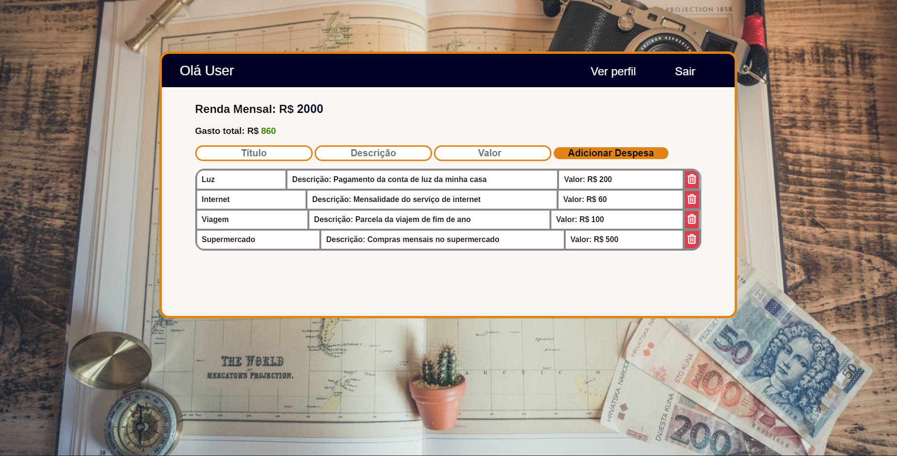
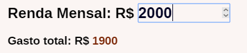

# Expenses Manager
Aplicação Web cujo objetivo é facilitar a administração de suas despesas.
>Organize suas despesas mensais e compare-as à sua renda mensal, evitando problemas de dívidas, entre outros.

## Como utilizar

- Crie a sua conta
- Faça Login
- Registre as suas despesas
- O app mostrará o valor total das despesas e irá compará-lo à sua renda.
> Você poderá editar o valor da sua Renda Mensal

## Construção da aplicação
- Server side em NodeJs (API REST)
- Base de dados SQLite, integração com o [Knex](http://knexjs.org)
- Frontend SPA usando o [Vanilla Router](https://github.com/Graidenix/vanilla-router#readme) e o [Handlebars](https://github.com/handlebars-lang/handlebars.js)